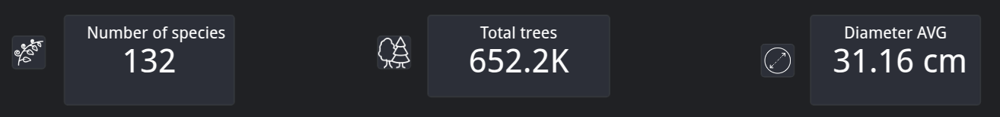
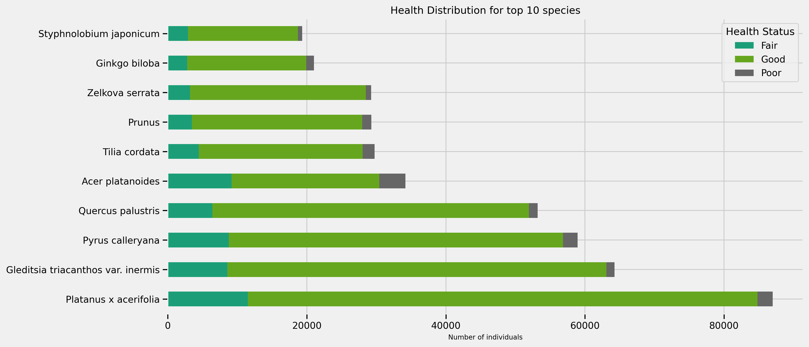
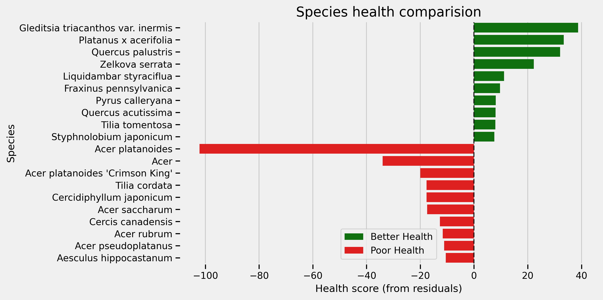
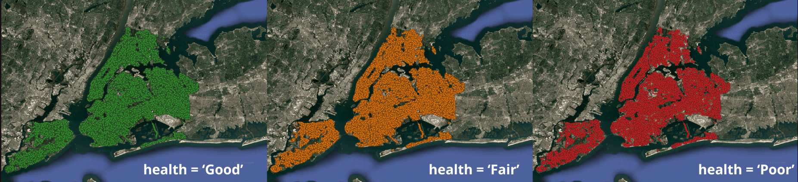
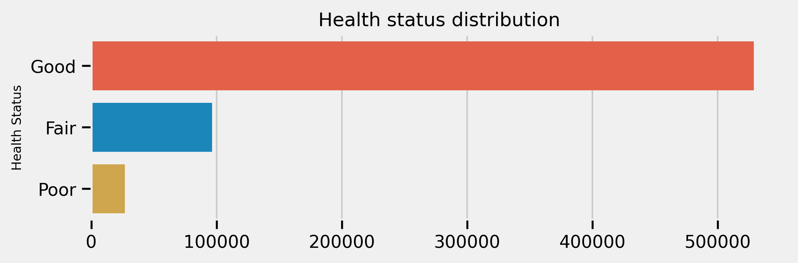
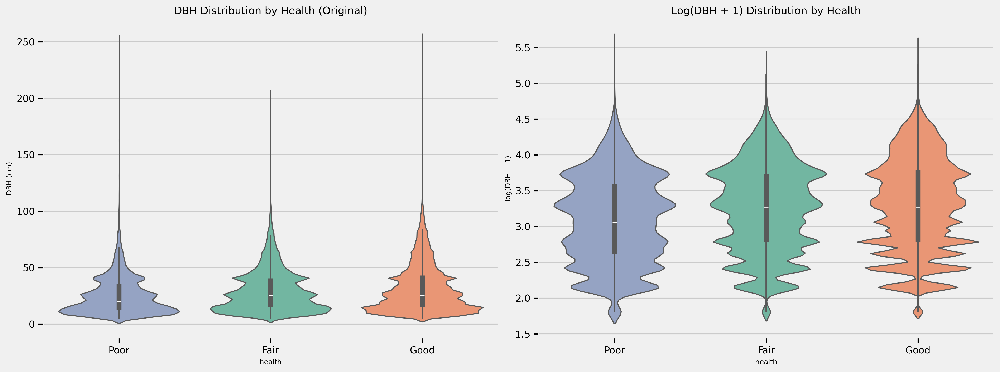
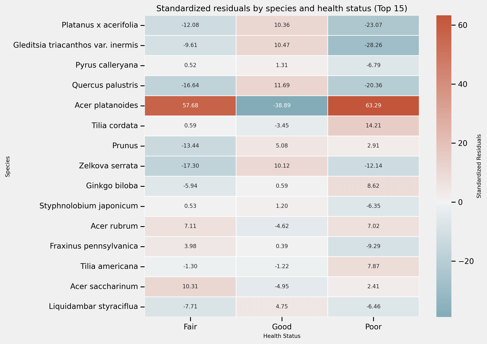

# 🌳 Analysis of the Health and Diversity of Urban Trees in NYC
This project analyzes the health status of street trees in urban areas of New York City (NYC). The primary objective is to determine whether there is a statistically significant relationship between tree species (spc_latin) and tree health status.

### Primary Objectives
Determine whether there is a statistically significant association between tree species (spc_latin) and tree health status.
Identify the most common tree species and assess their respective health conditions.

## 📂 Data Source
The dataset used is the TreesCount! 2015 Street Tree Census, conducted by volunteers and staff organized by NYC Parks & Recreation and partner organizations.

 [NYC Open Data - Trees](https://data.cityofnewyork.us/browse?q=trees&sortBy=relevance&page=1&pageSize=20)

### Summary 

After cleaning, standardizing, formatting, and visualizing the data, several statistical tests were performed. The results indicate a statistically significant correlation between tree species and their health status. Therefore, it would be possible to select more suitable species for urban planning and reforestation initiatives in and around the study area. 

Special attention could be given to species exhibiting more health issues, either by implementing measures to help them thrive or by considering their replacement.
Top 10 most common species and their health status.

Residuals summary for health status for top 10 species with better and poorer health

#### Species Exhibiting Better-Than-Average Health:
- Platanus × acerifolia
- Gleditsia triacanthos var. inermis
- Quercus palustris
- Zelkova serrata
  
#### Species Exhibiting Poorer-Than-Average Health:
- Acer platanoides (the most extreme case)
- Acer platanoides 'Crimson King'
- Acer sp.
- Tilia cordata

A quick overview in Qgis of the clean dataset showed no evident geospatial relationship between health status and its location.
 

### Implications for Urban Planning
These insights can help urban planners, landscape architects, and ecological restoration specialists in selecting resilient and suitable species for urban planting and reforestation programs.
Monitor vulnerable urban trees to improve their health and reduce the risk of accidents. This will require more statistical analysis and field monitoring.

## Process

#### Primary tools:
1. Pandas
2. Matplotlib
3. seaborn 
4. numpy 
5. scypy
6. statsmodel

### Data distribution
###### Health
There's an inbalancing amount of trees with "Good" health status compared to "Fair" and "Poor" statuses. This must be corrected before implementing ML models.
 

###### Diameter at Breast Height (DBH)
For this variable, extreme outliers were detected and addressed to minimize data loss. Specifically, living trees with a DBH (Diameter at Breast Height) equal to 0 cm were imputed with the 25th percentile value, while trees with a DBH greater than 254 cm were capped at the 75th percentile. Despite these adjustments, a high degree of variability remains in the data, as seen in the following chart:

 

### Statistical tests:
#### 1. Chi-squared of independence (for categorical variables)

###### Results
Chi2 statistic: 16732.70
p value: 0.0000000000
Degrees of freedom: 226
Conclusion: There is a significant association between species and health. (p < 0.05)

##### Analysis
Because p-value is so low, almost cero (statistically significant) and Chi2 is very high 16732.70, but the sample size is so large (>680,000), even weak relationships can be statistically significant due to chi-square's sensitivity to sample size.

#### 2. Cramer's V
Therefore, Cramer's V coefficient could properly complement the analysis by providing a standardized measure of the GLOBAL strength of the association between pairs of variables, which, along with Pearson's standardized residuals, will give a better picture of the relationship between tree species and their health status.

###### Results
'Cramer V value is : 0.11326304101368438, weak to moderate asociation'
In order

#### 3. #### Pearson's adjusted residuals (post hoc chi-squared)

In order identify local associations and detect remarkable combinations (species/health status). 
 

## Future steps:
- After balancing the dataset—using techniques such as SMOTE (Synthetic Minority Over-sampling Technique) or undersampling— machine learning models could be applied to predict tree health status. Specifically, an Ordinal Logistic Regression model could be implemented, using explanatory variables such as stewardship, presence of tree guards, and location. This approach may help to better understand the factors influencing tree health and improve urban forestry management strategies.

- Investigate the specific characteristics of species showing better health (such as Platanus x acerifolia, Gleditsia triacanthos and others).
