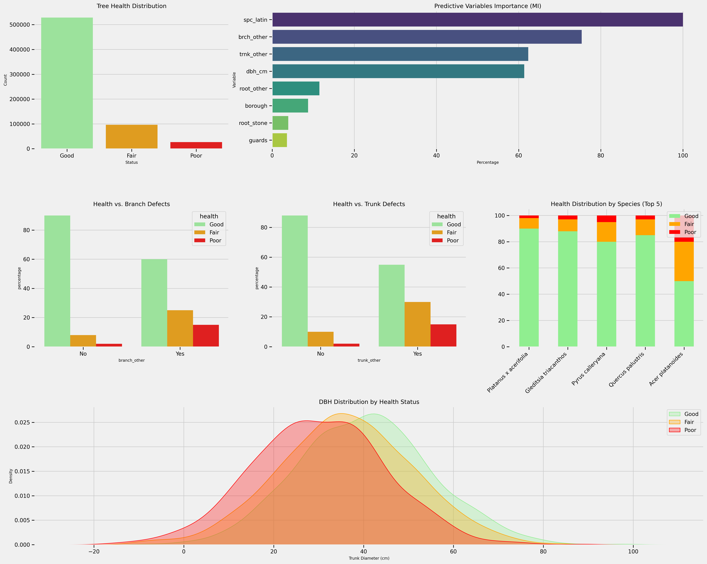

# 🌳 Analysis of the Health and Diversity of Urban Trees in NYC
This project analyzes the health status of street trees in urban areas of New York City (NYC). The primary objective is to determine whether there is a statistically significant relationship between tree species (spc_latin) and tree health status.

### Primary Objectives
Determine the variables that are stastitically correlated to tree health status.
Identify the most common tree species and assess their respective health conditions.

## Data Source
The dataset used is the TreesCount! 2015 Street Tree Census, conducted by volunteers and staff organized by NYC Parks & Recreation and partner organizations.

 [NYC Open Data - Trees](https://data.cityofnewyork.us/browse?q=trees&sortBy=relevance&page=1&pageSize=20)

### Summary 

After cleaning, standardizing, formatting, and visualizing the data, several statistical tests were performed. The results indicate statistically significant correlations between tree health status and 4 primary variables:

1. Species (spc_latin) - Different species show varied susceptibility to health issues
2. Diameter at breast height (dbh_cm) - Tree size correlates with overall health condition
3. Branch problems (brch_other) - The presence of branch defects is a strong indicator of poor health
4. Trunk problems (trnk_other) - Trunk integrity issues significantly impact tree condition
   
##### From this information, it would be possible to:

- Select more suitable species for urban planning and reforestation initiatives in and around the study area
- Give special attention to species exhibiting more health issues, either by implementing measures to help them thrive or by considering their replacement

#### Predictive Modeling Approach
Based on the identified predictive variables, a machine learning classification model could be developed to predict tree health status (Good, Fair, Poor). 

This predictive model could serve as a decision support tool for urban forestry management, allowing for proactive identification of trees at risk of health decline and optimizing maintenance resource allocation.

Top 10 most common species and their health status.

Residuals summary for health status for top 10 species with better and poorer health

#### Species Exhibiting Better-Than-Average Health:
- Platanus × acerifolia
- Gleditsia triacanthos var. inermis
- Quercus palustris
- Zelkova serrata
  
#### Species Exhibiting Poorer-Than-Average Health:
- Acer platanoides (the most extreme case)
- Acer platanoides 'Crimson King'
- Acer sp.
- Tilia cordata

A quick overview in Qgis of the clean dataset showed no evident geospatial relationship between health status and its location.
 

### Implications for Urban Planning
These insights can help urban planners, landscape architects, and ecological restoration specialists in selecting resilient and suitable species for urban planting and reforestation programs.
Monitor vulnerable urban trees to improve their health and reduce the risk of accidents. This will require more statistical analysis and field monitoring.

## Process

#### Primary tools:
1. Pandas
2. Matplotlib
3. seaborn 
4. numpy 
5. scypy
6. statsmodel

### Data distribution
###### Health
There's an inbalancing amount of trees with "Good" health status compared to "Fair" and "Poor" statuses. This must be corrected before implementing ML models.

###### Diameter at Breast Height (DBH)
For this variable, extreme outliers were detected and addressed to minimize data loss. Specifically, living trees with a DBH (Diameter at Breast Height) equal to 0 cm were imputed with the 25th percentile value, while trees with a DBH greater than 254 cm were capped at the 75th percentile. Despite these adjustments, a high degree of variability remains in the data, as seen in the following chart:

 

### Statistical tests performed:
#### 1. Descriptive statistics
#### 2. Correlation analysis (for categorical variables)
     - Mutual information Analysis
     - Cramer's V
#### 3. ANOVA to analyze Diameter and Health correlation

#### 4. Chi-squared of independence (for categorical variables)
Pearson's adjusted residuals (post hoc chi-squared) (for categorical variables)

Pearson's adjusted residuals Heatmap: identify local associations and detect remarkable combinations (species/health status). 
 

 

##### Future steps
-A machine learning classification model could be developed to predict tree health status (Good, Fair, Poor). 

- Investigate the specific characteristics of species showing better health (such as Platanus x acerifolia, Gleditsia triacanthos and others).
